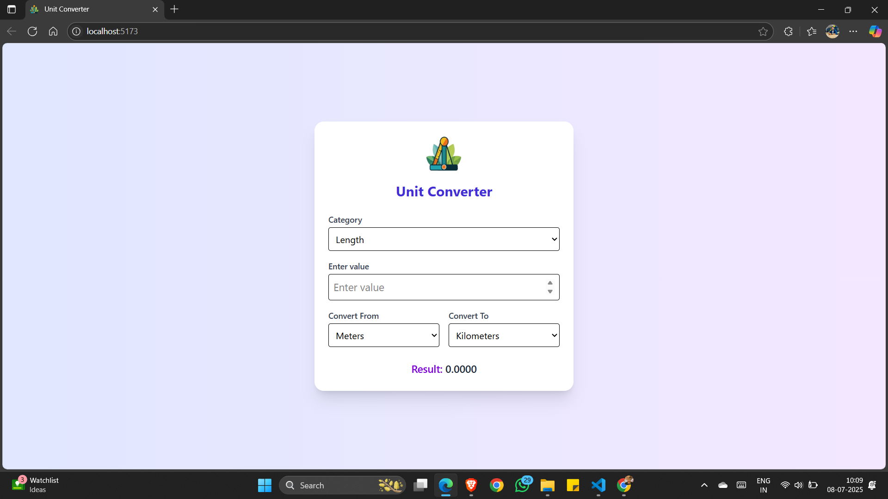
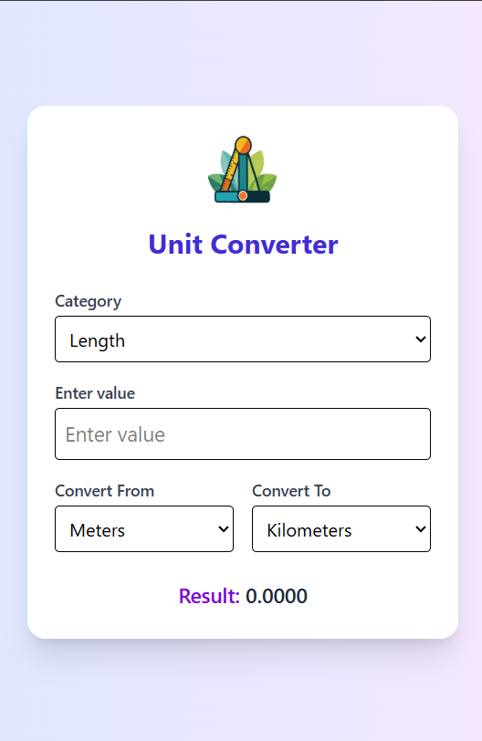

# 🔁 UnitEase – Unit Converter Web App

A modern and **responsive Unit Converter** web application built with **React.js** and **Tailwind CSS**. UnitEase allows you to seamlessly convert between common **Length** and **Weight** units with an intuitive UI.

---

## 🚀 Features

- 📏 Convert between Length units (meters, kilometers, feet, miles)
- ⚖️ Convert between Weight units (grams, kilograms, pounds)
- 📱 Fully Responsive UI
- 🎨 Clean and Minimal Design with Tailwind CSS
- ⚡ Instant Conversion with Real-time Input Updates

> 🔒 No login or API required. All conversions are done locally in your browser.

---

## 🛠️ Tech Stack

| Technology    | Description                         |
|---------------|-------------------------------------|
| React.js      | Component-Based Frontend Framework  |
| Tailwind CSS  | Utility-First CSS Framework         |
| Vite          | Blazing Fast Build Tool             |

---

## 🧩 Getting Started

### 1️⃣ Clone the Repository

```bash
git clone https://github.com/KFS-developer/unit-converter.git
```

### 2️⃣ Install Dependencies

```bash
npm install
```

### 3️⃣ Start React App

```bash
npm run dev
```

---

## 🌄 Screenshots
    
| Desktop View | Mobile View |
|--------------|-------------|
|  |  |

---

## 🌍 Live Demo

Coming soon...  
Host your frontend using **Vercel**/**Netlify** and backend via **Render**/**Glitch**.

---

## 👤 Author

**Patel Ketul**  

---

## 📃 License

Licensed under the [MIT License](LICENSE)

> ⭐ If you liked this project, please consider starring it on GitHub!